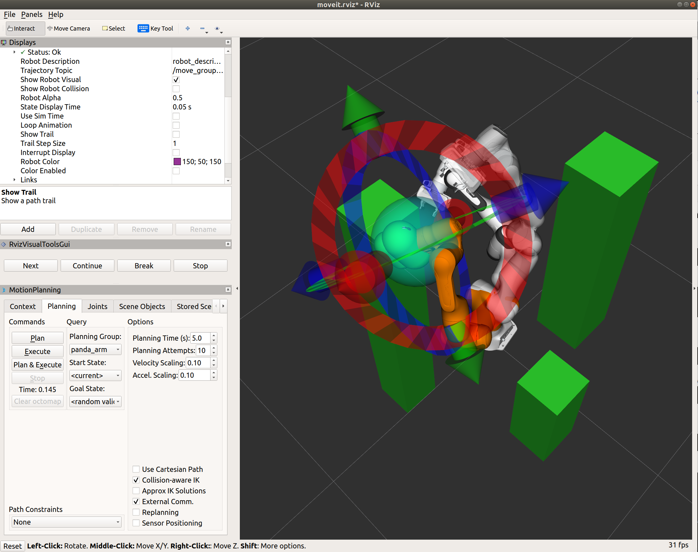

USE MOVEIT TO COLLECT ROBOT TRAJECTORY DATA
--------------------------------------------

**Collect trajectory data from a 7-DOF pandas robot arm in a Rviz environment with cluttered obstacles. Motion planning pipeline is OMPL-CHOMP integrated in moveit.**

 * Tutorial for Moveit: 
[Moveit step by step tutorial](https://ros-planning.github.io/moveit_tutorials/doc/getting_started/getting_started.html)
 . This project has been tested on Ubuntu18.04 ROS melodic with moveit1.
 * Requirements
Ubuntu18.04
[ROS melodic](http://wiki.ros.org/melodic/Installation/Ubuntu)
	
 * Installation:
   
<code> mkdir -p ~/ws_moveit/src \
             cd ~/ws_moveit/src \
	     git clone https://github.com/lucasyu17/moveit_sampling.git --recurse-submodules \
	     cd ~/ws_moveit && catkin build \
             source ~/ws_moveit/devel/setup.bash \
   
</code> 

 * Usage: After creating the neccessary ROS environments and installation of moveit
   * run the rviz world: 
 	
<code> roslaunch panda_moveit_config demo.launch pipeline:=ompl-chomp </code>

   * adding obstacles:
	
<code> python ~/ws_moveit/src/moveit_collect_data/scripts/collision_scene.py </code>

   * start the data listener:
	
<code> python ~/ws_moveit/src/moveit_collect_data/scripts/collect_data.py </code>

   * start sampling node:
	
<code> rosrun moveit_collect_data random_sampling </code>

